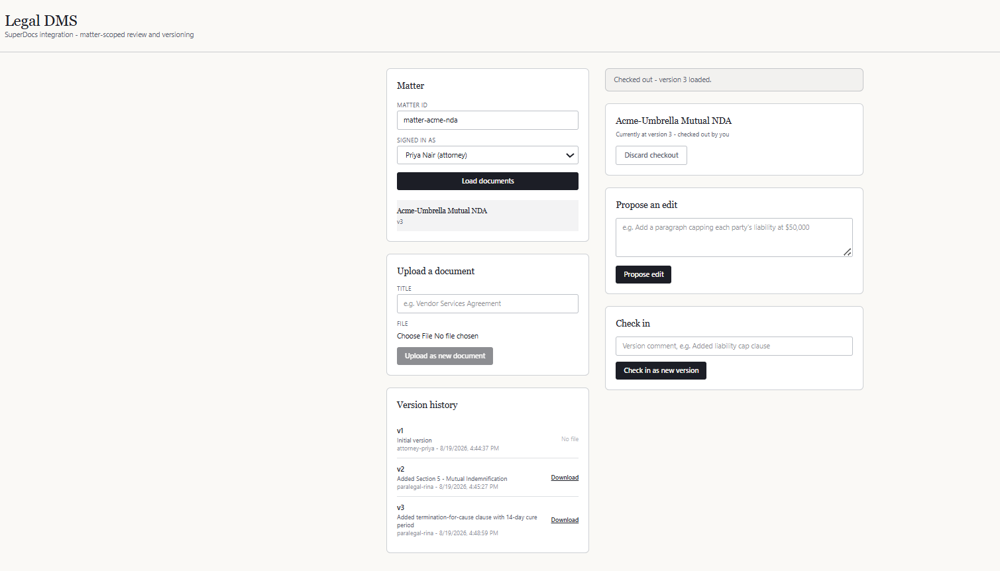
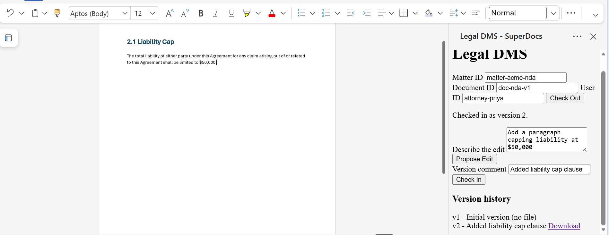
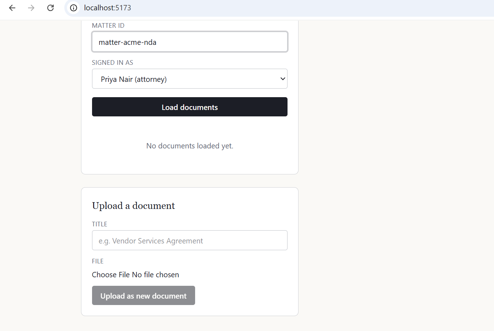
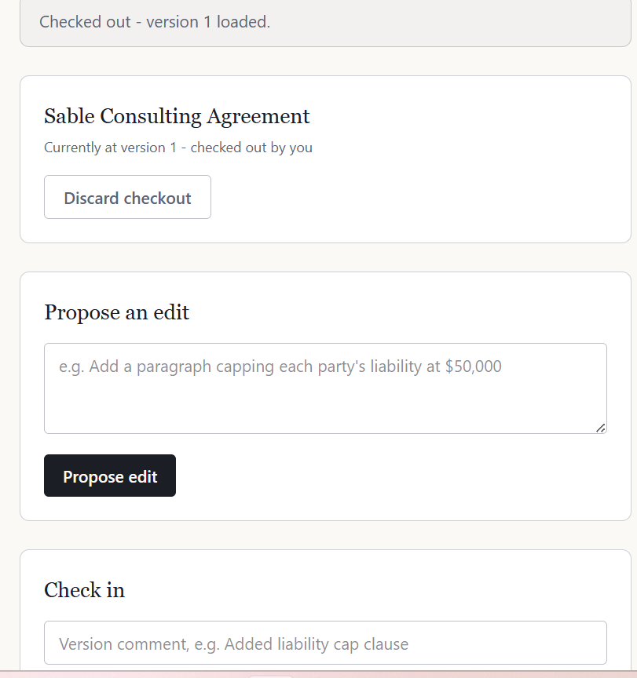

# Legal DMS ↔ SuperDocs Integration

Built for the SuperDocs Round 2 engineer task — assigned build: **Legal document-management
system integration** (S3). Built by Krisha Shah for the SuperDocs task.

## Screenshots

**Word add-in — live edit landing directly in the open document, task pane on the right:**



**Word add-in — version history inside the task pane, each version downloadable:**



**React web client — checkout and edit review:**


**React web client — version history with per-version download:**



**React web client — uploading a new document:**



## What this is

An integration layer between a legal DMS (matters, ethical walls, check-out/check-in,
version history) and SuperDocs's AI document-editing engine. SuperDocs supplies the editing;
this project supplies the legal-industry rules SuperDocs doesn't know about.

```
Lawyer → [this integration] → SuperDocs API (upload / chat / approve / export)
              │
              └── DMS (matters, ethical walls, locked check-outs, version history)
```

## What it does

- **Upload** a real file → becomes version 1, with the original bytes stored directly.
- **Check out** a document → locks it to one user, loads it into a fresh SuperDocs session.
- **Propose an edit** in plain English → SuperDocs returns a proposed change with an
  explanation, old/new content — nothing is applied yet.
- **Review** → accept or reject each change individually. Rejecting one never discards others.
- **Check in** → exports the approved result, saves it as a new version with a DMS-native
  comment and metadata, releases the lock.
- **Ethical walls** — a matter can restrict which users may see it at all. Enforced on every
  read/write, before SuperDocs ever sees a byte.
- **Precedent search** — searches across every matter a user can see, and only those.
- **Two host surfaces**: a React web client, and a Word add-in (Office.js task pane) that
  writes approved changes into the live document range-by-range, not as a full-file replace.

## Project layout

```
app/
├── dms/            Mock DMS - matters, ethical walls, locking, versions
├── superdocs/      SuperDocs API client (upload/chat/approve/export)
├── services/       workflow.py (the integration logic) + precedent_search.py
├── routers/        FastAPI HTTP endpoints
└── main.py         App entrypoint

web-client/         React + Vite + Tailwind frontend
word-addin/         Office.js task pane for Word
tests/              35 tests, all mocking SuperDocs - no live key needed
```

## Running it

**Backend:**

```
python -m venv .venv
.venv\Scripts\Activate.ps1
pip install -r requirements.txt
cp .env.example .env
uvicorn app.main:app --reload
pytest -v
```

**Web client:**

```
cd web-client
npm install
npm run dev
```

**Word add-in:**

```
npx office-addin-dev-certs install
cd word-addin
ws --port 3000 --https --cert "<path>\localhost.crt" --key "<path>\localhost.key" --directory .
```

Then in Word desktop: Insert → Add-ins → Upload My Add-in → `word-addin\manifest.xml`.

## Design decisions worth being explicit about

- **`cross_session_search`/`cross_session_memory` are never used.** Both are scoped to the
  API key owner, not to a matter — turning them on would let the AI reach across every matter
  on the account, bypassing the ethical wall this project exists to enforce.
- **Every checkout uploads a fresh SuperDocs session; we never reuse SuperDocs's own durable
  Files.** The DMS is the single source of truth for version history; SuperDocs is disposable
  scratch space for one checkout. Avoids two independent, potentially-drifting histories.
- **Auth is a plain X-User-Id header, not real login.** A real deployment sits behind the
  DMS's own SSO; building a password screen on top of an unverified header would be theater,
  not real security.
- **A denied-only checkout still creates a new version, byte-identical to the last.** Gives an
  honest audit trail ("reviewed, nothing accepted") rather than silently vanishing.

## Known limitations, told honestly

- **Unresolved bug**: a second edit approved within a checkout that began from a previous
  checkout's result can silently fail to persist — the checked-in file sometimes reflects the
  prior version's content, not the newly-approved change, with no error raised anywhere.
  Confirmed via direct MD5/content diffing, not assumed. A fresh session's first edit reliably
  works (validated live, byte-for-byte, multiple times, through both the React client and the
  Word add-in); the gap is specifically in what a second checkout on the same document
  persists forward. Root cause narrowed to SuperDocs session state after an approval, not
  fully solved as of this submission.
- **Precedent search ranking is keyword-overlap, not embeddings.** Access control is exact and
  tested; ranking quality wasn't the priority given the time budget.
- **No real iManage/NetDocuments connector.** Out of scope for a take-home; the workflow layer
  doesn't know or care that the DMS is mocked.
- **Version-1 seed/demo documents have no real exported file behind them** (fictional text, not
  a real upload) — download correctly 404s with an explanation. Real uploads always have a
  file from version 1.

## Corrections made after live API testing

Both `client.py` and `workflow.py` were originally written against the OpenAPI schema alone.
Live Postman testing surfaced two confirmed bugs, both fixed: `chat_async` wasn't sending
`document_html` (the AI silently couldn't see the document, no error raised); and real
`pending_changes` fields are `change_id`/`operation`/`old_html`/`new_html`/`ai_explanation`,
not the originally-guessed `summary`/`diff_html`.

## Tests

`pytest -v` — 35 tests, `tests/mocks.py` provides a `FakeSuperDocsClient` replicating real
API behavior so the whole suite runs with no network access and no API key.
